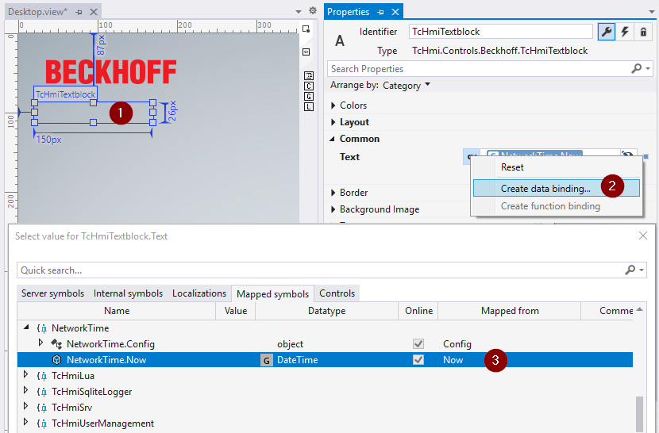

# Interacting with a server extension

Every server extension provides a set of symbols that clients, the HMI server, as well as other
server extensions can use to interact with the server extension.
There are several ways to invoke these symbols in the client.

## Via a Data Binding

- Drop an HMI control from the toolbox and create a "Data Binding" to a control attribute
- Browse to the symbol that you want to invoke in the "Mapped Symbols" tab

  

- In the example shown in the screenshot, the current timestamp is periodically fetched from an NTP server by the "NetworkTime" extension and displayed in the "TcHmiTextblock"

## Using the Framework API

- Send a [request](https://infosys.beckhoff.com/content/1031/te2000_tc3_hmi_engineering/4674537867.html?id=7421642661702637947) to the HMI server
- Add a [CodeBehind script](https://infosys.beckhoff.com/content/1033/te2000_tc3_hmi_engineering/3749459595.html?id=3920871439687428926) to the HMI project

**Example JavaScript:** Register `onPressed` event of button to request server extension symbol

```js
var destroyEvent = TcHmi.EventProvider.register(
    'TcHmiButton.onPressed',
    function (evt, data) {
        if (TcHmi.Server.isWebsocketReady()) {
            var request = {
                requestType: 'ReadWrite',
                commands: [
                    {
                        symbol: 'NetworkTime.Now',
                        commandOptions: ['SendErrorMessage']
                    }
                ]
            };

            // Send request to TwinCAT HMI Server.
            TcHmi.Server.requestEx(request, { timeout: 2000 }, function (data) {
                // Callback handling.
                if (data.error !== TcHmi.Errors.NONE) {
                    // Handle TcHmi.Server class level error here.
                    return;
                }
                var response = data.response;
                if (!response || response.error !== undefined) {
                    // Handle TwinCAT HMI Server response level error here.
                    return;
                }
                var commands = response.commands;
                if (commands === undefined) {
                    return;
                }
                for (var i = 0, ii = commands.length; i < ii; i++) {
                    var command = commands[i];
                    if (command === undefined) {
                        return;
                    }
                    if (command.error !== undefined) {
                        // Handle TwinCAT HMI Server command level error here.
                        return;
                    }
                    // Print network time (readValue to browser console)
                    console.log(command.symbol + '=' + command.readValue);
                }
            });
        }
    }
);
```
