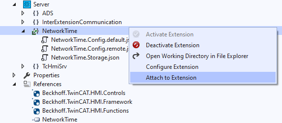

# Debugging the `Init` method of a server extension

## Debugging a server extension

You can attach a debugger to an active server extension by right-clicking on
the extension entry in the solution explorer and selecting "Attach to Extension":



An alternative way to attach a debugger to a server extensions is described here:
[Working with server extensions](../resources/WorkingWithServerExtensions.md)

This alternative is especially useful when your extension is not running in the HMI engineering.

## Debugging the `Init` method

Every server extension has an `Init` method. This method is called immediately
when the extension is started by an HMI server.
To debug a problem in your server extension's `Init` method, a debugger must be
attached before it is executed.

You can use the following code snippet to pause the initialization process
until a debugger is attached:

```c#
public ErrorValue Init()
{
    while (!System.Diagnostics.Debugger.IsAttached)
    {
        Thread.Sleep(500);  // check every 500ms
    }
    System.Diagnostics.Debugger.Break();  // signal a breakpoint to the attached debugger

    // ...

    return ErrorValue.HMI_SUCCESS;
}
```
