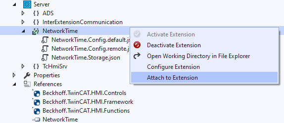

# Working with server extensions

The HMI Server can be extended with so-called server extensions like an alarms
& events system or a recipe management system. Server extensions can also be
developed in .NET with a software development kit, which allows users to
develop their own logic and implement additional communication protocols.

## Loading a server extension

Many existing server extensions are available via the NuGet package manager.
To load your custom server extension or one of the sample extensions contained
in this repository, please follow these steps:

1. Open the Visual Studio solution file (.sln) of the server extension sample
project
1. Build the server extension project by right-clicking the project

    

1. Add a TwinCAT HMI project to the solution
1. Add reference of the server extension by right-clicking of the "References"
node of the HMI project

    

1. Activate the server extension by enabling the checkbox

    

1. Check status of the extension by unfolding the "Server" node of the HMI project

    

    - A green arrow is displayed if the extension is loaded
    - A red arrow is displayed in case of an error. For more information, check
    the error list of Visual Studio and the server configuration page.

## Debugging a server extension

There are two ways to attach to the extension process to debug your .NET server
extension.

### **Attach directly**

1. Right-click on the active server extension and select "Attach to Extension":

    

1. You can now place breakpoints and debug the extension

### **Attach via the list of available processes**

This way also works if the extension project is not in the current solution or
if you want to debug an extension that is running in a remote server.

1. Attach to the "TcHmiExtensionContainer" process:

    

1. You can now place breakpoints and debug the extension

## Extension configuration page

The HMI server generates a configuration page for every server extension.
It can be used to edit the persistent configuration variables.
There are several ways to access the configuration page of an extension.

### **Via the extension entry inside the HMI engineering**

1. Double-click on the entry of the server extension:

    

### **Via the taskbar notification area (SysTray)**

1. Find the HMI server icon in the taskbar notification area:

    

1. Open the configuration page in a web browser:

    

1. Go to the respective tab to open the configuration page of your extension:

    

## Deployment of a server extension

The [package management](https://infosys.beckhoff.com/content/1033/te2000_tc3_hmi_engineering/8775976075.html?id=2478659332484499905)
in TwinCAT HMI version 1.12 is based on the NuGet package management system.
This makes it possible to [export](https://infosys.beckhoff.com/content/1033/te2000_tc3_hmi_engineering/8776096395.html?id=3666977321511551618)
the TwinCAT HMI components into a NuGet package.
